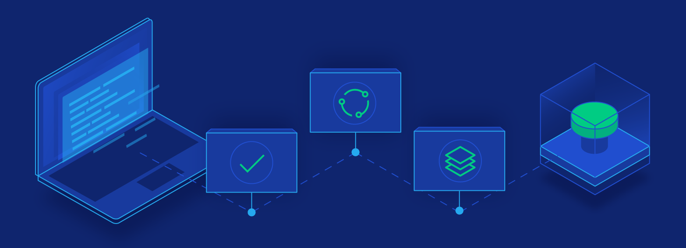

import { CodeWave } from "gatsby-theme-waves"

---
Quality engineering is about improving quality across the project, not just dogmatically automating requirements tests.

With the challenges of many company cultures I have developed my own pragmatic approach to improving software quality - it's always possible.

Test automation is only part of the path that leads to better quality with CI and CD.

<CodeWave>

```bash
$ curl -s -v -o /dev/null -I -w "%{http_code}" http://jaffamonkey.com
*   Trying 35.169.225.248...
* TCP_NODELAY set
* Expire in 149999 ms for 3 (transfer 0x55a114e985c0)
* Expire in 200 ms for 4 (transfer 0x55a114e985c0)
* Connected to jaffamonkey.com (35.169.225.248) port 80 (#0)
> HEAD / HTTP/1.1
> Host: jaffamonkey.com
> User-Agent: curl/7.64.0
> Accept: */*
> 
< HTTP/1.1 301 Moved Permanently
< Date: Fri, 26 Jul 2019 11:49:40 GMT
< Connection:Keep-Alive
< Content-Length: 0
< Cache-Control: private, no-cache, no-store, max-age=0
< Expires: Mon, 01 Jan 1990 0:00:00 GMT
< Location: https://jaffamonkey.netlify.com
< 
* Connection #0 to host jaffamonkey.com left intact
```

## Test Engineering

It's all about what's appropriate, to both development and business sides to a project.

Sometimes investing is a feature-rich test framework is a good idea. 

A test framework that is well-thought out and maintained, will retain usefulness for the whole team.

```bash 15:17
$ npm install -g assert superagent

// test-api.js
const superagent = require('superagent');
const assert = require('assert');

superagent
  .get('http://localhost:3001/api/v1/todos')
  .end((err, res) => {
    assert.ifError(err);
    assert.equal(res.status, 200);
    console.log('Result: ' + res.text)
    });

$ node test-api.js
Result: {"success":"true","message":"todos retrieved successfully","todos":[{"id":1,"title":"example"}]}
```

But if you have the build pipepline in sights, then you had better make sure tests run as lean (fast) as possible.

Test engineering is where Testing meets (Dev)Ops!
```bash 1:13
$ npm install -g assert superagent

// test-api.js
const superagent = require('superagent');
const assert = require('assert');

superagent
  .get('http://localhost:3001/api/v1/todos')
  .end((err, res) => {
    assert.ifError(err);
    assert.equal(res.status, 200);
    console.log('Result: ' + res.text)
    });

$ node test-api.js
Result: {"success":"true","message":"todos retrieved successfully","todos":[{"id":1,"title":"example"}]}
```

#### Code or Not Code

Writing test code is easier, and there is a raft of packages to help you ... or hinder you. 

Start with too many packages, then you will quickly end up with an unused test framework.

Start small - don't use a package if it can be coded natively.

Conversely, don't waste too much time on native code - packages are there too help you, just be selective.

The API test is a very basic example, but step up to UI tests (with reporting) and already complexitiy increases.

```markdown
* Quality assurance blurb 
* Quality assurance blurb 
* Quality assurance blurb 
* Quality assurance blurb 
* Quality assurance blurb 
* Quality assurance blurb 
* Quality assurance blurb 
```

## Quality assurance

* Continual review of quality efforts, at all stages of the project pipeline.

* Encourages the business to think outside of requirements, and understand the beenfits of an exploratory mindset.

```markdown
Some coaching blurb
Some coaching blurb
Some coaching blurb
Some coaching blurb
Some coaching blurb
Some coaching blurb
Some coaching blurb
```

## Coaching

* We can show your team how to do Quality Engineering, from the ground up with training that is customed to your project needs.

```markdown
Some training blurb
Some training blurb
Some training blurb
Some training blurb
Some training blurb
Some training blurb
Some training blurb
```

## Training courses

* We also provide training for more advanced software engineering coding and approaches.
* We can combine training with real project work,to maximise the value of the training.

</CodeWave>
