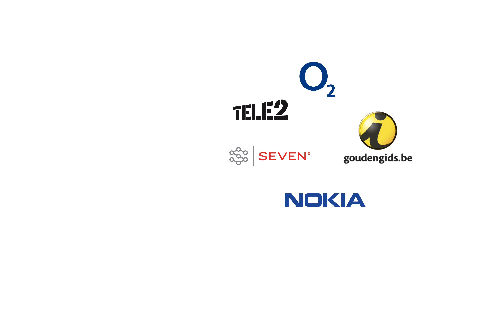

import { ImageWave } from "gatsby-theme-waves"
import PageLayout from "../../components/images/layout"
export default PageLayout

<ImageWave variant="fullscreen">

# I have clients in many industries

## Mobile/Telco

Achievement: Test manager on the initial rollout of MMS and Mobile video services with o2 and Nokia, ensuring new devices and OS's were constently checked as part of testing lifecycle. 

## Broadcast

Achievement: Test managed on major ingestion, streaming and video-editing projects at BBC Technology, during their huge transition to digital media.

## Gaming

Achievement: Introduced Quality Assurance for the online game development at Walt Disney Internet Group, creating strategies and managing third-party developers.

## Publishing

Achievement: Coordinated efforts at publishers like Emap and Incisive Media, implementing a centralised CMS to enable better management and collabaroation between their magazines.

## Creative

Achievement: Helped many creative and digital agencies, to improve the quality of their web and mobile development.

## Public sector

Achievement: Contibuted to new wave of Public sector Agile projects, and a radicaly change in work culture, in the wake of multiple failures of large IT service companies.

## Finance

Achievement: Managed testing for multiple Agile and BDD projects at KPMG, aiming to monetize their existing big data.

## Utilities

Achievement: Surviving

</ImageWave>
